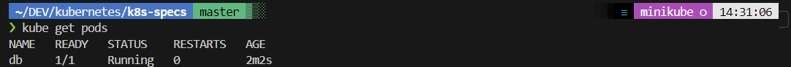

# Deploying and declaring pods
Continuing after first installation

## Prerequisite
Having installed docker and minikube running (see the first day).

## Use Case
In  this example Im deploying a mongo DB database in the minikube cluster. As shown in the paget 7.Run Pods in the book.

```
git clone https://github.com/vfarcic/k8s-specs.git

cd k8s-specs


kubectl run db --image mongo

```

It didn't work since the "--generator" command look deprecated but the mentioned command worked with no errors.



To delete a pod is as simple as "kubectl delete pod db".


## Learnings


So far we have deployed a pod in an imperative way for learning purposes, but we should always use a declarative format.

This is how a pod declaration should look like: pod.yml

```
apiVersion: v1 // means the version 1 of the Kubernetes pod API; API version and kind has to be provided -- it is mandatory
kind: Pod
metadata: // the metadata provides information on the pod, it does not specifiy how the pod behaves
name: db
labels:
type: db
vendor: MongoLabs // I assume, who has created the image
spec:
containers:
- name: db
image: mongo:3.3 // image name and tag
command: ["mongod"]
args: ["--rest", "--httpinterface"] // arguments, defined in an array

```
All these are the arguments that can be used in a pod declaration:
https://kubernetes.io/docs/reference/generated/kubernetes-api/v1.17/#pod-v1-core

We can use the folling command to see all the info about the pod:

```
kubectl get pods -o json

```

Now, to check inside the pods we can use the following command (similar to docker).

```
kubectl exec -it db sh
```

This starts a terminal inside the pod and now we are able to run the commands inside to check the pod service, in this case we are using a mongo db image:

```
mongo
db.stats()
exit
exit

```
We check the database stats and we get out.

Then we delete the pod to clean it up, this time pointing to the pod declaration location.

```
kubectl delete -f pod/db.yml

```

## Declaring 2 containers in one pod

We can declare many containers in one pod declaration as in the following example

```
❯ cat pod/go-demo-2.yml                                                                                              ─╯

apiVersion: v1
kind: Pod
metadata:
  name: go-demo-2
  labels:
    type: stack
spec:
  containers:
  - name: db
    image: mongo:3.3
  - name: api
    image: vfarcic/go-demo-2
    env:
    - name: DB
      value: localhost
```

When creating it and checking the pods we get 1 service with 2/2 ready:

```
kubectl create -f pod/go-demo-2.yml
kubectl get -f pod/go-demo-2.yml
```


To check all the containers in the pod that contain the declaration we can use the following command:

```
kubectl get -f pod/go-demo-2.yml -o jsonpath="{.spec.containers[*].name}"
```
And to get the logs of an specific container in the pod service:
```
kubectl logs go-demo-2 -c db
```

With the command describe it is possible to see all stats of the pod:

´´´
kubectl describe \
-f pod/go-demo-2-health.yml

´´´
