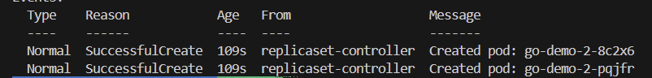
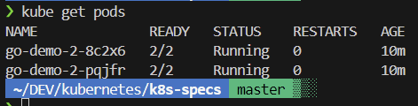

# Replica sets

## Introduction
Replica sets is the number of the same pods has to be running, if there are more thatn the stablished, the cluster will automatically kill the extra ones, or create if some pods die and are under the stablished replica set number. 

It can exist different replicas of the same pod.
It is to scale horizontally.


All pods are controlled by "Controllers" and "Services".

## Use Case

To practice this scenrio, we deploy the pod declaration "rs/go-demo-2.yml" which container a replicaset of 2.

If we run the command "kubectl describe -f rs/go-demo-2.yml"
We can see the deployed node replicas:


We can also see more pod infomartion with the following commands:

´´´
kubectl get pods --show-labels
kubectl get replicasets
´´´

ReplicaSets are named using the same naming convention as used for pods.

## Note
Difference between ReplicaSet and Replication Controller.
They both serve the same purpose — the Replication Controller is being deprecated.


## Oprating ReplicaSets

It is possible to delete the ReplicaSet while keeping the deployed pods:

´´´
kubectl delete -f rs/go-demo-2.yml --cascade=orphan

´´´

Now the replicaset is eliminated but the pods still running.

Now, if we deploy again the same pod declaration with the replicaset, the ReplicaSet will be created again and coexist with the previus pods.
So now we would have deployed a pod with a replica set and another pod with no replicaset.



## Clean up

To remove al the deployed pods:

```
kube delete -f rs/go-demo-2.yml
```
Since all the pods were deployed with the same pod declaration, "rs/go-demo-2" in this case, this will delete all deployed pods for this test.