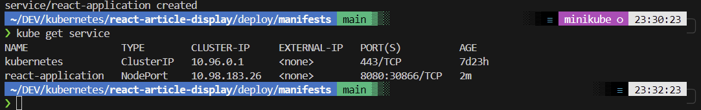
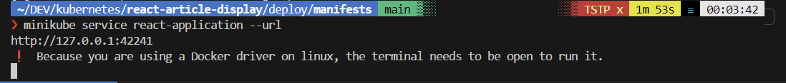
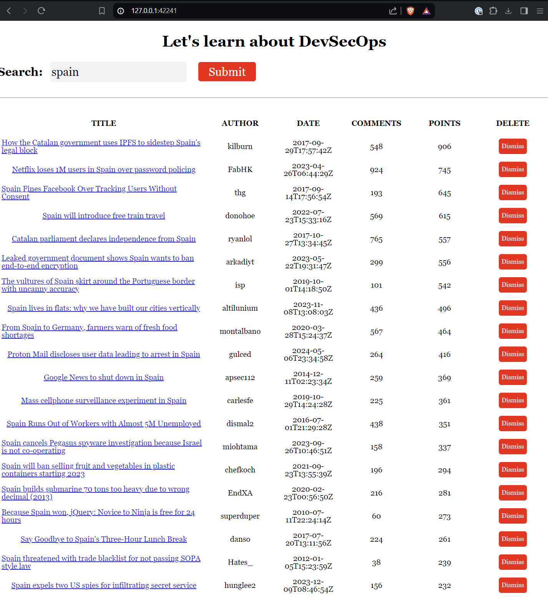

# Kubernetes deployments

To study the Kubernetes deployments we are gonna be using the following application:
https://github.com/anais-codefresh/react-article-display

Some things that deployments allow you to do:

- Deploy a replica set or pod
- Update pods and replica sets
- Rollback to previous deployment versions
- Scale a deployment
- Pause or continue a deployment

## Creating a deployment

A kubernetes deployment consist on a .yml file.
For this example we are gonna be using the provided examople deployment based on the mentioned existing applicaiton:

deployment.yml (in the manifest folder)

´´´
apiVersion: apps/v1
kind: Deployment
metadata:
  name: react-application
spec:
  replicas: 2
  selector:
    matchLabels:
      run: react-application
  template:
    metadata:
      labels:
        run: react-application
    spec:
      containers:
      - name: react-application
        image: anaisurlichs/react-article-display:master
        ports:
          - containerPort: 80
        imagePullPolicy: Always

´´´

once the file is created, run the following command to deploy the deployment.yml:

´´´
kubectl create -f deployment.yaml

´´´
To check the status of the deployment we can run:

´´´
kubectl describe deployment <deployment name>

´´´

Then we proceed to create the service:
´´´
apiVersion: v1
kind: Service
metadata:
  name: react-application
  labels:
    run: react-application
spec:
  type: NodePort
  ports:
  - port: 8080
    targetPort: 80
    protocol: TCP
    name: http
  selector:
    run: react-application

´´´

´´´
kubectl create -f service.yaml
´´´

## Use Case

Now, with the "kubectl get service" we can see the Cluster-IP of the service "nodePort"

We are supose to be able to access to the deployed app thought that IP and the 8080 exposed mapped port.

:warning: For the minikube version (the one im using in my WSL in Windows) it is not possible to access the Nodepotr IP since it is an IP insise the doocker container of minikube.
To expose to localhost the service run:

´´´
minikube service <service-name> --url
´´´
S
This will create a PORTS tunnel that will allow you to access the deployed service using your localhost.

To get more information about the service we can run:

´´´
kubectl get svc <service name> -o yaml

´´´

Finally to clean the testing environment:

´´´
kubectl delete service react-application
kubectl delete deployment react-application

´´´